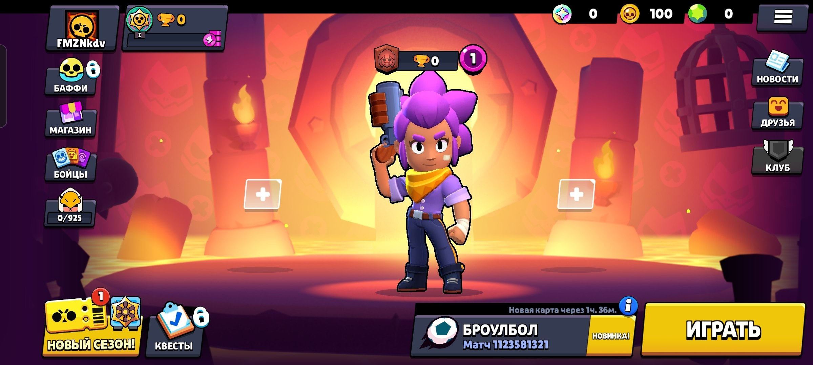

# BSFv67-Sharp

This is a Brawl Stars Core server (version 67.264.1) (write krksh) rewritten in **C# (.NET 8.0)**. It is a fork of the original server written in Zig by **fmzkdv**.

## Features
- Fully translated to C# with a minimalist, clean, lowercase code style.
- Asynchronous TCP listener using modern `async`/`await` socket loops.
- Core packet structure, custom byte stream parsing, and packed booleans.
- Translated packet serialization logic with a custom compiler script.

## Requirements
- .NET SDK (8.0 or newer)
- Windows / Linux / macOS

## Building

```bash
dotnet build BSFv67-Sharp.csproj
```

## Running

```bash
dotnet run --project BSFv67-Sharp.csproj
```

The server will start listening on `0.0.0.0:9339` by default.
